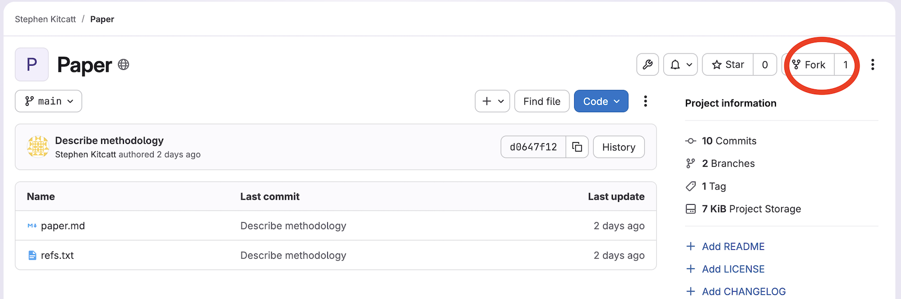

Merge Requests are a great solution for contributing to repositories to which
you don't have write access. Adding other people as *collaborators* to a remote
repository is a good idea but sometimes (or even most of the time) you want to
make sure that their contributions will provide more benefits than the
potential mistakes they may introduce.

In large projects, primarily Open Source ones, in which the community of
contributors can be very big, keeping the source code safe but at the same time
allowing people to make contributions without making them "pass" tests for their
skills and trustworthiness may be one of the keys to success.

Leveraging the power of Git, GitLab provides a functionality called *Merge
Requests*. Essentially it's "requesting the owner of the repository to pull in
your contributions". The owner may or may not accept them. But for you as
a contributor, it was really easy to make the contribution.

You may already have heard of *Pull Requests* in Github. Merge requests are the
equivalent in GitLab.

## The process

- Find a repository on GitLab that belongs to someone else
- **Fork** it (`git clone` it on the server into your GitLab account)
- `git clone` it to your PC/laptop
- Create a new branch
- Make changes, and push them to your repository on GitLab
- Request that the owner of the repository you *forked* pulls in your changes

## Advice for submitting Merge Requests
- Keep your Merge Request small and focussed (makes it easier to process)
	- Submit one request per issue
	- Create a separate branch for each issue you work on
	  (you can submit a request from any branch)
- R.T.F.M.
	- If the repository has contributing guidelines, read them,
	  and follow the guidance. This gives your request a better chance of being accepted.
	- Some repositories pre-populate the body of the request or issue message
	  with a template.
		- Follow the instructions (e.g. provide the information requested)
- Consider creating a new issue first to discuss your ideas before submitting a request.
  Some repositories have contributing guidelines,
  but this can be a good approach even if it isn't required,
  so that you know whether the owner agrees with your suggestion,
  and might bring up ideas and/or challenges you haven't considered.

## After submitting your merge request
If things go well, your request may get merged just as it is.
However, the repository owner may want to discuss it with you first
and a request for further edits to be made.
Given your changes haven't been merged get, you can make changes either by adding
further commits to your branch and pushing them,
or you could consider rewriting your history neatly using an interactive rebase onto
an earlier commit.
In either case, your Merge Request will update automatically once you have pushed your commits.

> ## Send me a Merge Request!
> Let's look at the workflow and try to repeat it:
>
> 1. **Fork** [this
> repository](https://gitlab.scicom.picr.man.ac.uk/skitcatt/paper)
> by  clicking on the `Fork` button at the top right of the page.
> 
>
> 1. Navigate back to your home directory so you don't clone into an existing repo
> in the next step
>
>     ~~~
>     $ cd
>     ~~~
>     {: .language-bash}
>
> 1. Clone the repository from **YOUR** GitHub account.
> On GitLab, click on the green `Code` button  to get the HTML address to clone.
> You should be running a command like this:
>
>	~~~
>	$ git clone https://gitlab.scicom.picr.man.ac.uk/<Your Username>/paper.git forked-paper
>	~~~
>	{: .output}
>
> 1. `cd` into the directory you just cloned.
>    ~~~
>    $ cd forked-papers
>    ~~~
>    {: .language-bash}
> Create a new branch, then make changes you want to contribute. Get creative!
>    ~~~
>    $ git switch -c <your-new-branch>
>    ~~~
>    {: .language-bash}
> Commit and push them back to your repository.
>    ~~~
>    $ git push origin <your-new-branch>
>    ~~~
>    {: .language-bash}
> You won't be able to push back to the repository you forked from
> because you are not added as a contributor!
> 1. Go to the GitLab page for your forked repository, click *code* in the left hand panel and then "Merge requests" > "New Merge Request"
> 1. Select your forked repo as the source branch, and my repository as the destination, then press merge!
> 1. The owner of the original repository gets a notification that someone
> created a merge request - the request can be reviewed, commented and merged in
> (or not) via GitLab.
{: .challenge}

[issues]: https://github.com/features/issues
[projects]: https://docs.github.com/en/issues/planning-and-tracking-with-projects/learning-about-projects/about-projects
[close via commit]: https://github.com/gcapes/git-course/commit/b76e9fe967d4f1a1a612399bb4fb615cef70e2e0


